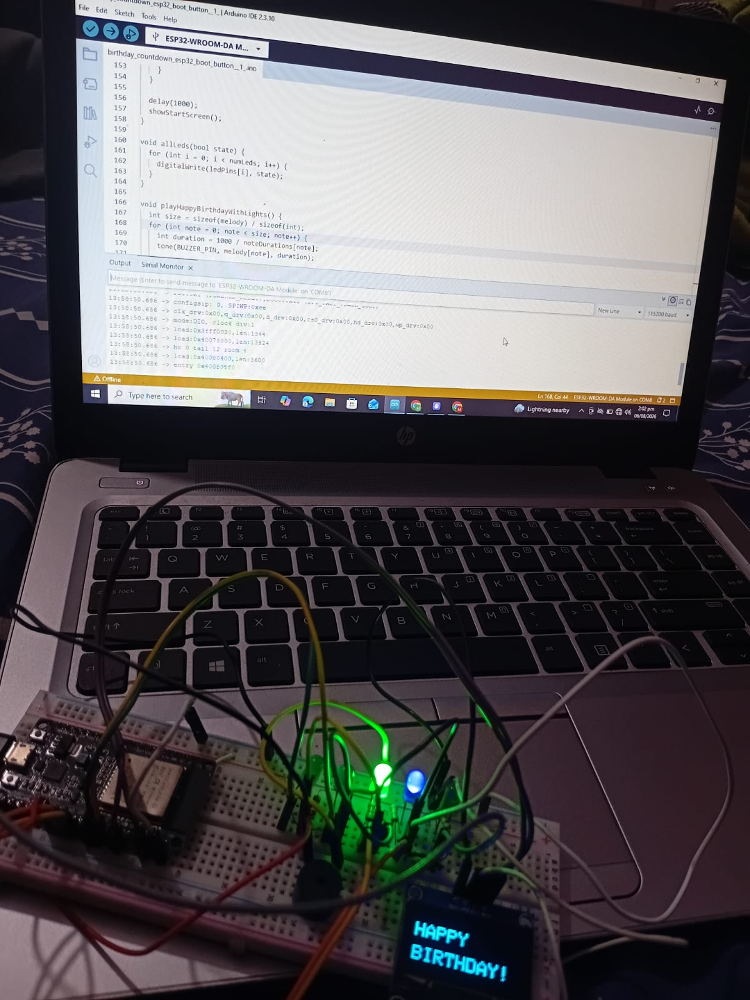

# 🎉 ESP32 Birthday Countdown Project


🎂 🎉 🎈 💡 🔊 🎶


---

## 📌 Overview

This is a fun embedded systems project built using ESP32.
It displays a countdown on an OLED screen, controls LEDs, and plays a "Happy Birthday" tune using a buzzer — all triggered with a single button press.

---

## 🧰 Components Used

- ESP32 Dev Board
- OLED Display 1.3" SH1106 (I2C)
- Buzzer
- 5 LEDs
- Push Button (Built-in BOOT button)
- Breadboard + jumper wires

---

## 🔌 Connections

| Component | ESP32 Pin          |
| --------- | ------------------ |
| OLED SDA  | GPIO 21             |
| OLED SCL  | GPIO 22             |
| Buzzer    | GPIO 4              |
| LEDs      | 18, 19, 17, 16, 15  |
| Button    | GPIO 0 (BOOT)       |

> OLED I2C address: `0x3C`

---

## ⚡ Features

✨ Press BOOT button to start
⏳ Countdown animation (10 → 0) on OLED
💡 LED chasing effect during countdown
🔊 Buzzer alert when countdown ends
🎶 "Happy Birthday" melody played note-by-note
🎇 Disco LED effect after the tune
🖥️ OLED shows "HAPPY BIRTHDAY!" message + name screen

---

## 🛠️ How It Works (Code Overview)

- Uses the **Adafruit_SH110X** + **Adafruit_GFX** libraries to drive the OLED over I2C.
- `startCountdown()` loops from 10 → 0, updating the OLED each second and chasing one LED per second via `ledPins[i % numLeds]`.
- Once the countdown hits zero, all LEDs flash 3 times with a buzzer beep (`Time's Up!`).
- `playHappyBirthdayWithLights()` plays the birthday tune using `tone()`, reading frequencies from the `melody[]` array and durations from `noteDurations[]` — one LED lights up per note.
- A disco LED effect runs for 3 seconds, followed by a personalized name screen on the OLED.
- After everything, the display resets back to "Press BOOT to Start."

---

## 📷 Setup Photo



*Live setup: ESP32 wired on breadboard with OLED showing "HAPPY BIRTHDAY!" and Arduino IDE running the sketch.*

---

## 🎥 Project Demo

> Video demo: upload your `.mp4` directly in the GitHub README editor (drag & drop) or as an Issue attachment — GitHub will generate a `user-images.githubusercontent.com` link. Paste that link below to replace this line.

```
[https://github.com/user-attachments/assets/42feebff-bf5c-45b8-a967-ce042b007545]
```

---

## ▶️ How to Run

1. Install required libraries: **Adafruit SH110X**, **Adafruit GFX** (via Arduino Library Manager)
2. Wire the components as per the connections table above
3. Select board: **ESP32 Dev Module** (or ESP32-WROOM-DA, based on your board)
4. Upload the code
5. Press the **BOOT** button on the ESP32 → Enjoy the countdown + birthday surprise 🎉

---

## 📂 Repo Structure

```
birthdaywish/
├── firmware/
│   └── birthday_countdown_esp32_boot_button.ino
├── images/
│   └── setup_photo.png
└── README.md
```

---

## 🚀 Future Improvements

- Add RTC module for auto-triggering on the actual birthday date
- WiFi-based custom message input (via phone/web form)
- Store name/message on SD card instead of hardcoding
- Add battery + enclosure for a portable gift version

---

## 📄 License

MIT License — free to use and modify.
